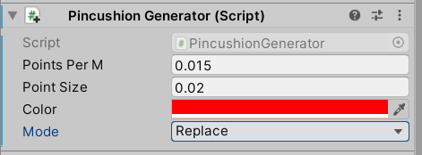

# Pincushion


Uniformly sample points on a mesh. 

This repo has three components:

1. `pincushion` is a Rust library that uses a very fast algorithm to sample points on a mesh. This is sufficient for static meshes that only need to be sampled once but, because `pincushion` is CPU-bound, it's not suitable for meshes that will dynamically deform (e.g. `SkinnedMeshRenderer` in Unity).
2. `PincushionCs` contains native bindings for `pincushion` and Unity methods for sampling points and applying them to meshes.
3. `UnityExample` is a small Unity example of Pincushion.

## How to add `Pincushion` to your Unity project

1. Download and install Rust
2. Within this repo, `cd pincushion` and `cargo build --release`
3. Copy the library into your Unity Project. It's located in: `pincushion/target/release/`
4. Copy the `PincushionCs/` folder into your Unity project.

## Usage (Unity)

1. Create an object with a `MeshFilter` and `MeshRenderer`.
2. Add a `StaticPointsGenerator` component:



3. Set parameters as desired:

| Parameter | Description |
| --- | --- |
| Points Per M | The number of sampled points per square meter on the mesh surface. |
| Point Size | The size of each point in square meters. |
| Color | The color of each point. |
| Mode | Controls how the points are handled in the scene (see below). |

| Mode | Description |
| --- | --- |
| Create | Create a new GameObject and mesh with sampled points. |
| Create and Hide Original | Create a new GameObject and mesh with sampled points. Keep the original GameObject but hide it. |
| Replace | Replace the original mesh with the sampled points mesh. No new GameObject is created. |

Assuming you haven't chosen Replace (which doesn't create a new object), you can show/hide the original mesh or new mesh:

1. `PincushionRenderer pr = gameObject.GetComponent<PincushionRenderer>()`
2. To show/hide the original object: `pr.SetOriginalVisibility(show)` where `show` is a boolean.
3. To show/hide the the new object: `pr.SetMyVisibility(show)` where `show` is a boolean.

## Usage (Rust)

Pincushion can alternatively be used in a native Rust context.

To add `pinchusion` to your project: `cargo add pincushion`.

### Example Usage

```rust
use tobj::{load_obj, GPU_LOAD_OPTIONS};

use pincushion::{sample_points_from_ppm, Triangle, Vertex};

fn get_obj(path: &str) -> (Vec<Vertex>, Vec<Triangle>) {
    let obj = &load_obj(path, &GPU_LOAD_OPTIONS).unwrap().0[0].mesh;
    let vertices = obj
        .positions
        .chunks_exact(3)
        .map(|v| [v[0], v[1], v[2]])
        .collect::<Vec<Vertex>>();
    let triangles = obj
        .indices
        .chunks_exact(3)
        .map(|triangle| {
            [
                triangle[0] as usize,
                triangle[1] as usize,
                triangle[2] as usize,
            ]
        })
        .collect::<Vec<Triangle>>();
    (vertices, triangles)
}

fn main() {
    let (vertices, triangles) = get_obj("tests/suzanne.obj");
    let points_per_m = 0.015;
    let _ = sample_points_from_ppm(&vertices, &triangles, points_per_m);
}

```

### Features

- `ffi` (default) will compile FFI-safe wrapper functions. This is required when compiling `pincushion` into a library that can be used in Unity.
- `cs` should only be enabled when generating the C# code (see below).

### Create C# Code

1. Create the C# files:

```sh
cargo run --bin cs --features cs
```

The files will be in `../PincushionCs/`

2. Compile the native Rust library:

```sh
cargo build --release
```

The library will be located in `target/release/`

### Example

To run the example: `cargo run --example suzanne`

Documentation for the Rust codebase can be found on [docs.rs](https://docs.rs/pincushion/latest/pincushion/).