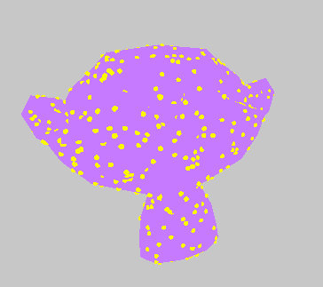
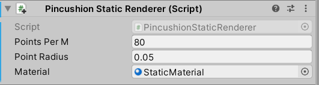
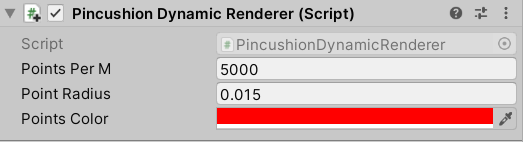

# Pincushion



Uniformly sample points on a mesh. 

This repo has three components:

1. `pincushion` is a Rust library that uses a very fast algorithm to sample points on a mesh. This can also be used to get the vertices of quads per sampled point. `pincushion` has FFI-safe functions that can be used in C#.
2. `PincushionCs` contains native bindings for `pincushion` and Unity methods for sampling points and applying them to meshes. It also contains shaders for rendering points.
3. `UnityExample` is a small Unity example of Pincushion.

## How to add `Pincushion` to your Unity project

1. Download and install Rust
2. Within this repo, `cd pincushion` and `cargo build --release`
3. Copy the library into your Unity Project. It's located in: `pincushion/target/release/`
4. Copy the `PincushionCs/` folder into your Unity project.

## Usage (Unity)

### 1. Sample points

To sample points on a MeshRenderer, add a `PincushionStaticRenderer` component:



| Parameter | Description |
| --- | --- |
| Points Per M | The number of sampled points per square meter on the mesh surface. |
| Point Radius | The radius of each point in meters. |
| Material | The material used to render each point. |

To sample points on a SkinnedMeshRenderer, add a `PincushionDynamicRenderer` component:



| Parameter | Description |
| --- | --- |
| Points Per M | The number of sampled points per square meter on the mesh surface. |
| Point Radius | The radius of each point in meters. |
| Color | The color of each point. |

### 2. Show/hide the original/sampled mesh

Assuming you haven't chosen `Replace` for your creation mode (which doesn't create a new object), you can show/hide the original mesh or new mesh:

1. `PincushionRenderer pr = gameObject.GetComponent<PincushionRenderer>()`
2. To show/hide the original object: `pr.SetOriginalMeshVisibility(show)` where `show` is a boolean.
3. To show/hide the the new object: `pr.SetSampledMeshVisibility(show)` where `show` is a boolean.

### 3. How it works

There are two methods of rendering sampled points because there is an efficient way to render points if we know that the mesh can't deform (i.e. if it is rendered via a MeshRenderer).

- MeshRenderers are sampled exactly once and then rendered as a mesh composed of multiple quads, one at each sampled point.
- SkinnedMeshRenderers are sampled exactly once and rendered using a geometry shader.

## Usage (Rust)

Pincushion can alternatively be used in a native Rust context.

To add `pinchusion` to your project: `cargo add pincushion`.

### Example Usage

```rust
/// Add feature "obj" to enable `from_obj`.
use pincushion::{from_obj, sample_points_from_ppm};

fn main() {
    let (vertices, triangles, _) = from_obj("tests/suzanne.obj");
    let points_per_m = 0.15;
    let _ = sample_points_from_ppm(points_per_m, &vertices, &triangles);
}

```

### Features

- `ffi` (default) will compile FFI-safe wrapper functions. This is required when compiling `pincushion` into a library that can be used in Unity.
- `cs` should only be enabled when generating the C# code (see below).

### Create C# Code

1. Create the C# files:

```sh
cargo run --bin cs --features cs
```

The files will be in `../PincushionCs/`

2. Compile the native Rust library:

```sh
cargo build --release
```

The library will be located in `target/release/`

### Example

To run the example: `cargo run --example suzanne`

### Benchmarks

To run the benchmark: `cargo bench benchmark`

Results:

Sampling: 51μs

Documentation for the Rust codebase can be found on [docs.rs](https://docs.rs/pincushion/latest/pincushion/).