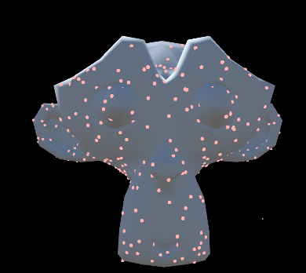

# Pincushion



Uniformly sample points on a mesh. 

This repo has three components:

1. `pincushion` is a Rust library that uses a very fast algorithm to sample points on a mesh. This can also be used to get the vertices of quads per sampled point. `pincushion` has FFI-safe functions that can be used in C#.
2. `PincushionCs` contains native bindings for `pincushion` and Unity methods for sampling points and applying them to meshes. It also contains shaders for rendering points.
3. `UnityExample` is a small Unity example of Pincushion.

## How to add `Pincushion` to your Unity project

1. Download and install Rust
2. Within this repo, `cd pincushion` and `cargo build --release`
3. Copy the library into your Unity Project. It's located in: `pincushion/target/release/`
4. Copy the `PincushionCs/` folder into your Unity project.
5. Project Settings -> Player -> Allow 'unsafe'  Code

## Usage (Unity)

### 1. Sample points

Pincushion offers two types of PincushionRenderers:

1. **`PincushionMeshRenderer`** samples a preexisting `MeshFilter` + `MeshRenderer` exactly once. *This is very performant.* When points are sampled, they are randomly jostled, for spice.
2. **`PincushionSkinnedMeshRenderer`** samples a preexisting `SkinnedMeshRenderer`. *This is less performant* because points need to be re-sampled per-frame. 

| Parameter | Description |
| --- | --- |
| Color | The color of each point. |
| Texture | The texture of each point. |
| Points Per M | The number of sampled points per square meter on the mesh surface. |
| Point Radius | The radius of each point in meters. |
| Constant Scaling | If true, every point will render at the same size. |
| Scale Points Per M By Camera | If true, scale the number of points by the object's initial distance from the camera. |
| Occlusion Mode | This controls what gets occluded and what occludes. |
| Show Original Mesh | If true, show the original mesh on Awake() |
| Show Sampled Mesh | If true, show the sampled mesh on Awake() |

Occlusion Modes:

| Value | Description | 
| --- | --- |
| None | No occlusion other than points occluding points. |
| Backfacing | Don't draw points facing away from the camera. |
| SourceMesh | Don't draw points facing away from the camera.<br>Source meshes will become solid colors and occlude points. |

### 2. Show/hide the original/sampled mesh

Assuming you haven't chosen `Replace` for your creation mode (which doesn't create a new object), you can show/hide the original mesh or new mesh:

1. `PincushionRenderer pr = gameObject.GetComponent<PincushionRenderer>()`
2. To show/hide the original object: `pr.SetOriginalMeshVisibility(show)`
3. To show/hide the the new object: `pr.SetSampledMeshVisibility(show)`


### 3. How to resample

```
PincushionRenderer pr = gameObject.GetComponent<PincushionRenderer>();
pr.Set();
```

## Usage (Rust)

Pincushion can alternatively be used in a native Rust context.

To add `pinchusion` to your project: `cargo add pincushion`.

Documentation for the Rust codebase can be found on [docs.rs](https://docs.rs/pincushion/latest/pincushion/).

### Example Usage

```rust
use pincushion::Mesh;

fn main() {
    // Add feature "obj" to enable `from_obj`.
    let mesh = Mesh::from_obj("tests/suzanne.obj");
    let points_per_m = 80.;
    let scale = 1.;
    let _ = mesh.sample_points(points_per_m, scale);
}

```

### Features

- `ffi` (default) will compile FFI-safe wrapper functions. This is required when compiling `pincushion` into a library that can be used in Unity.
- `cs` should only be enabled when generating the C# code (see below).

### Create C# Code

1. Create the C# files:

```sh
cargo run --bin cs --features cs
```

The files will be in `../PincushionCs/`

2. Compile the native Rust library:

```sh
cargo build --release
```

The library will be located in `target/release/`

### Example

To run the example: `cargo run --example suzanne --featueres obj`

### Benchmarks

To run the benchmark: `cargo bench benchmark --features obj`

Results:

Sampling: 70μs